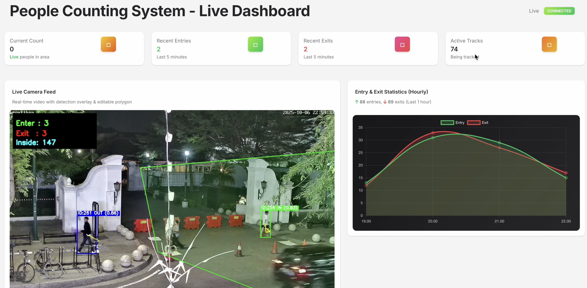
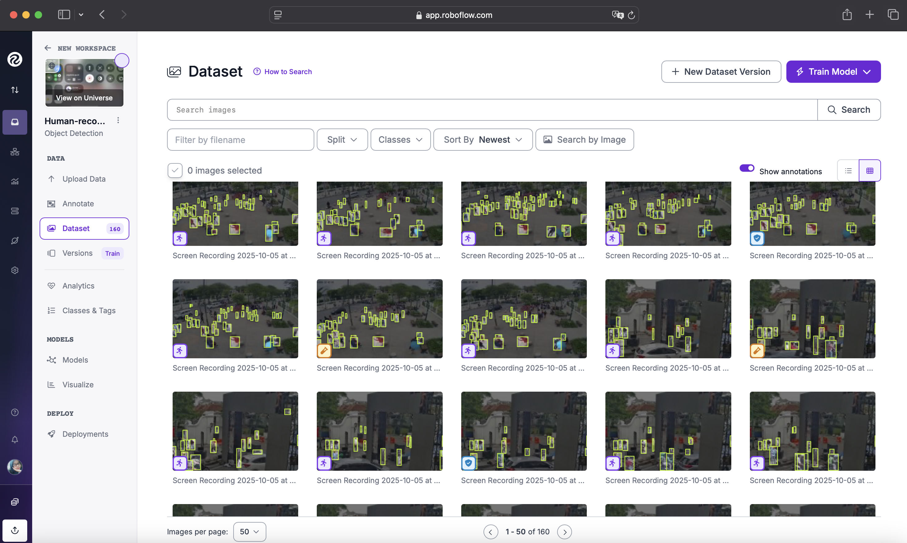
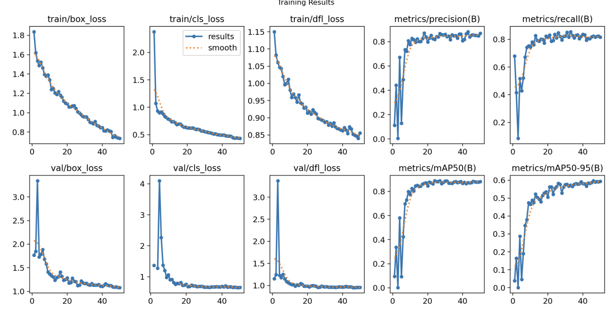
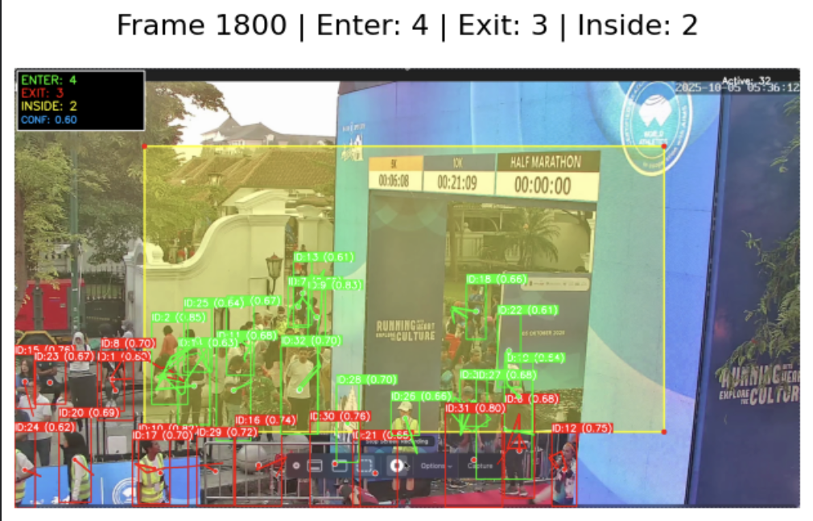

1. Desain Database  (Done) 
2. Pengumpulan Dataset (Done)
4. Object Detection & Tracking (Done) 
5. Counting & Polygon Area  (Done) 
6. Prediksi (Forecasting) (Done)
7. Integrasi API (API/Front End) (Done)
8. Deployment (Done)

CHALLENGE 1: DESAIN DATABASE
Untuk sistem ini, digunakan NoSQL database dengan MongoDB karena fleksibilitasnya dalam menyimpan data yang tidak terstruktur. Database ini terdiri dari 3 koleksi utama: Deteksi, Counting, dan Area Config.

1. Deteksi (detections)
Menyimpan data deteksi objek (misalnya orang) yang terdeteksi dalam video feed.
Field:
- track_id (Integer): ID unik untuk setiap objek yang terdeteksi.
- timestamp (Datetime): Waktu deteksi objek.
- bbox (Array): Koordinat bounding box (x1, y1, x2, y2).
- in_polygon (Boolean): Menunjukkan apakah objek berada dalam area polygon.
- area_name (String): Nama area polygon.

2. Counting Events (counting_events)
Menyimpan data jumlah orang yang masuk atau keluar dari area polygon.
Field:
- track_id (Integer): ID unik dari objek yang terdeteksi.
- event_type (String): Jenis event (masuk/keluar).
- timestamp (Datetime): Waktu terjadinya event.
- area_name (String): Nama area polygon.

3. Area Config (area_config)
Menyimpan data konfigurasi area polygon yang digunakan untuk deteksi.
Field:
- area_name (String): Nama area polygon.
- coordinates (Array): Koordinat dari polygon yang digunakan untuk deteksi.
- description (String): Deskripsi area (misalnya, nama lokasi).
- created_at (Datetime): Waktu pembuatan area.
- updated_at (Datetime): Waktu terakhir area diperbarui.

Relasi Antar Tabel
Deteksi berhubungan dengan Area Config melalui area_name.
Counting Events berhubungan dengan Deteksi melalui track_id.

CHALLENGE 2: PENGUMPULAN DATASET
Dataset yang Digunakan:
- Malioboro_10_Kepatihan.stream
- Malioboro_30_Pasar_Beringharjo.stream
- NolKm_Utara.stream
Dataset diambil secara langsung dari live stream cctv daerah Yogyakarta. Dataset diambil dengan beberapa variasi kondisi, berdasarkan waktu mulai dari pagi, siang, dan malam, serta berdasarkan tingkat keramaian mulai dari sepi, sedang, hingga sangat ramai. Hal ini dilakukan untuk membuat generalisasi model dan mengoptimalkan pendeteksian. Anotasi dilakukan secara mandiri menggunakan platform Roboflow, berikut gambar proses anotasi.

Jumlah data yang digunakan adalah 160 dengan masing-masing gambar rata-rata memiliki 10 lebih objek yang teranotasi, dengan pembagian 70% untuk train, 20% untuk validasi, dan 10% untuk test.

CHALLENGE 3: OBJECT DETECTION & TRACKING

Implementasi Deteksi dan Pelacakan
YOLOv11m digunakan untuk mendeteksi objek (misalnya orang) di dalam video feed. Pengerjaan training dapat dilihat "dashboard-people-counter/backend/models/model-training.ipynb"  pada Setelah objek terdeteksi, Centroid Tracking digunakan untuk melacak objek tersebut berdasarkan ID unik. Sistem kemudian menghitung berapa kali objek masuk atau keluar dari area polygon yang telah ditentukan.

Hasil testing
Final Epoch Results:
  mAP@50     : 0.8818
  mAP@50-95  : 0.5942

Other Metrics:
  Precision  : 0.8689
  Recall     : 0.8164

Langkah-langkah Implementasi:
- Deteksi Objek: Menggunakan model YOLO untuk mendeteksi objek dalam video.
- Tracking: Menggunakan Centroid Tracking untuk melacak objek yang terdeteksi berdasarkan ID unik dan menghitung jumlah orang yang masuk/keluar area.
- Counting: Setiap kali objek masuk atau keluar dari area polygon, perhitungan dilakukan untuk mencatat jumlah orang yang berada di dalam area.

CHALLENGE 6:: INTEGRASI SISTEM (API & DASHBOARD)

Program ini sudah dilengkapi front-end dan backend. Frontend sistem ini menggunakan JavaScript dan Backend sistem ini menggunakan FastAPI. Beberapa endpoint yang digunakan:

Statistics Endpoints:
GET /api/stats/: Mengambil statistik umum (data perhitungan).
GET /api/stats/live: Mengambil statistik langsung/real-time.
GET /api/stats/detections: Mengambil data deteksi objek yang terdeteksi oleh sistem.
GET /api/stats/events: Mengambil event terkait perhitungan objek (misalnya masuk atau keluar).
POST /api/stats/forecast: Menghasilkan prediksi/ramalan untuk perhitungan objek di masa depan.

Configuration Endpoints:
GET /api/video/stream: Mengambil aliran video langsung dari sistem.
GET /api/video/snapshot: Mengambil snapshot gambar dari video stream.

Root & Health:
GET /: Mengambil informasi dasar dari root API.
GET /health: Memeriksa status kesehatan API (health check).

CHALLENGE 7: DEPLOY

Program ini sudah mengimplementasikan conterization, cara running program:
1. Menjalankan Backend: buka direktori root, kemudian jalankan 'docker-compose up -d --build'
2. Menjalankan Frontend: buka direktori root, kemudian jalankan python3 -m http.server 3000
3. Akses Frontend dari browser 'http://localhost:3000/pages/dashboard.html'
4. Akses Backend (BE) di Browser atau API Client 'http://localhost:8000/docs'